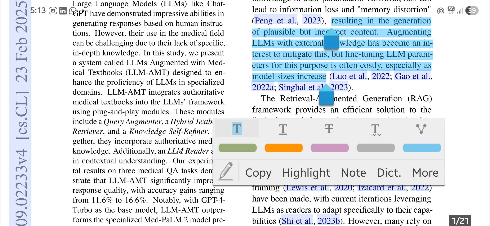
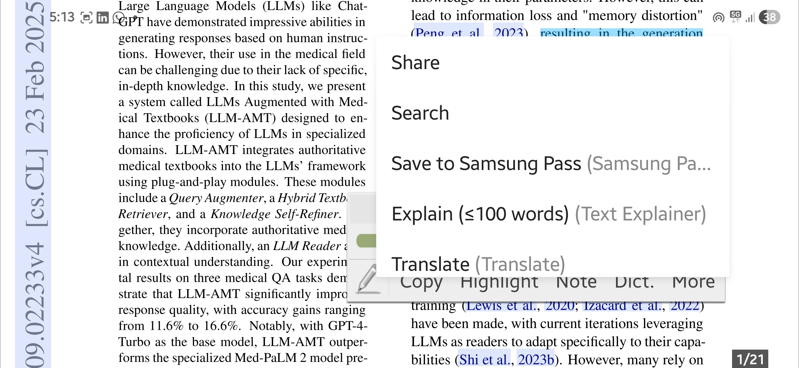
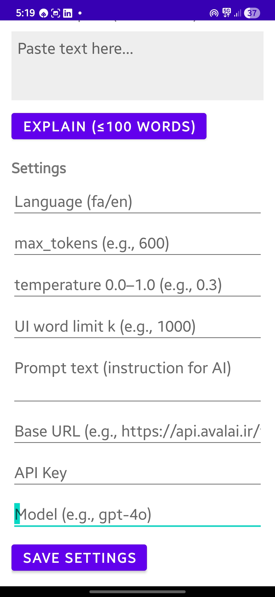

# 📚 **SnapExplain**

### ✨ *Instant LLM Explanations Inside Any Reader App*

When reading PDFs or ebooks, you often encounter sentences that need deeper understanding — meaning, nuance, translation, or analysis. Switching apps and crafting prompts manually disrupts your focus.

**SnapExplain** solves this by integrating directly into Android’s text-selection menu.
Highlight any text → tap **Explain** → get an LLM-generated response in a popup.

---

## 🚀 **Features**

* ⚡ **One-tap explanations** from any supported reading app
* ✏️ **Custom system prompt** for your personalized style
* 🤖 Works with **any LLM API** (OpenAI, AvalAI, local servers, etc.)
* 🪟 **Popup window** for quick, non-intrusive results
* 📲 Integrates seamlessly into **Moon+ Reader**, **Librera**, and most apps
* 🎛️ Fully configurable: model, tokens, temperature, output limits
* 🔐 API key stored **locally**

---

## 🎯 **Why SnapExplain?**

Traditional workflow:

1. Copy text
2. Switch apps
3. Paste
4. Re-enter instructions
5. Read response
6. Switch back

With SnapExplain:
👉 **Highlight → Explain → Continue reading**

Perfect for:

* 🔍 Clarifying complex academic sentences
* 📖 Understanding difficult vocabulary or phrases
* 🧠 Getting contextual interpretations
* 🌐 Nuanced translations
* 📝 Quick summaries or comparisons

---

## 🧩 **How It Works**

1. You define your **custom prompt** (your interpretation/analysis style).
2. You highlight any text in a reader app.
3. Android’s selection menu shows **Explain (≤100 words)**.
4. SnapExplain sends your prompt + highlighted text to the LLM API.
5. The result appears in a popup window without leaving your book.

---

## 🔧 **Settings Overview**

### 🌐 **Language (fa/en)**

Default output language for responses.

### 📏 **max_tokens**

Maximum model output length.
Higher = longer responses.

### 🎚️ **temperature (0.0–1.0)**

Controls creativity:

* Low → precise
* Medium → balanced
* High → creative

### 📝 **UI Word Limit**

Caps the number of words shown in the popup (for readability).

### 💡 **Prompt Text**

Your personal instruction for the LLM.
Example:

> “Explain this text in simple Persian and compare it with similar expressions.”

### 🔗 **Base URL**

Your model endpoint (e.g. `https://api.avalai.ir/v1/`).

### 🔑 **API Key**

Used to authenticate with the API (stored locally).

### 🤖 **Model**

Name of the model you want to use (e.g., `gpt-4o`, `gpt-5-mini`, `llama3`, etc.).

---

## 🖼️ **Screenshots**

---

## ⚙️ **Installation**

1. Download the APK from Releases
2. Install on Android
3. Open the app and configure your API settings
4. Start any reader app
5. Highlight text → tap **Explain**

---

## 📌 **Roadmap**

* [ ] Offline LLM support
* [ ] History of explanations
* [ ] Custom popup themes
* [ ] Multi-prompt presets

---

## 🛡️ **Privacy**

* Your API key is stored **locally** on your device.
* Highlighted text is sent **only** to the API endpoint you configure.
* No data is collected by SnapExplain.

---

## 🙌 **Contributing**

Pull requests, issues, and feature suggestions are welcome.
